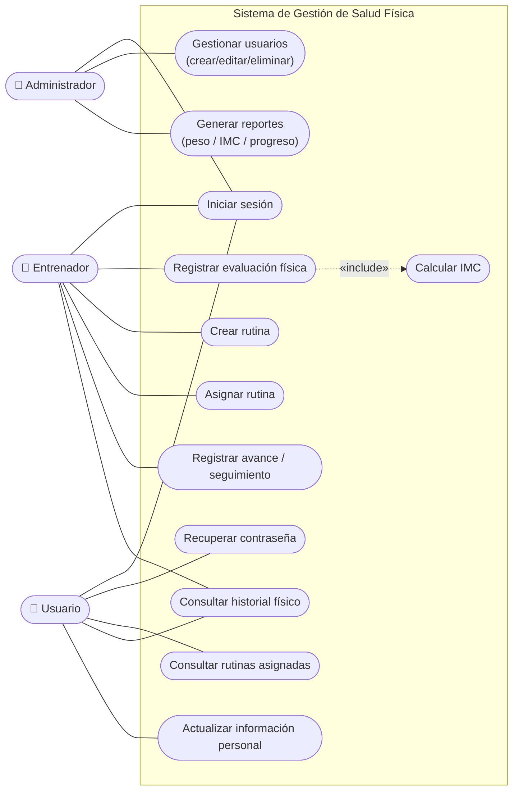
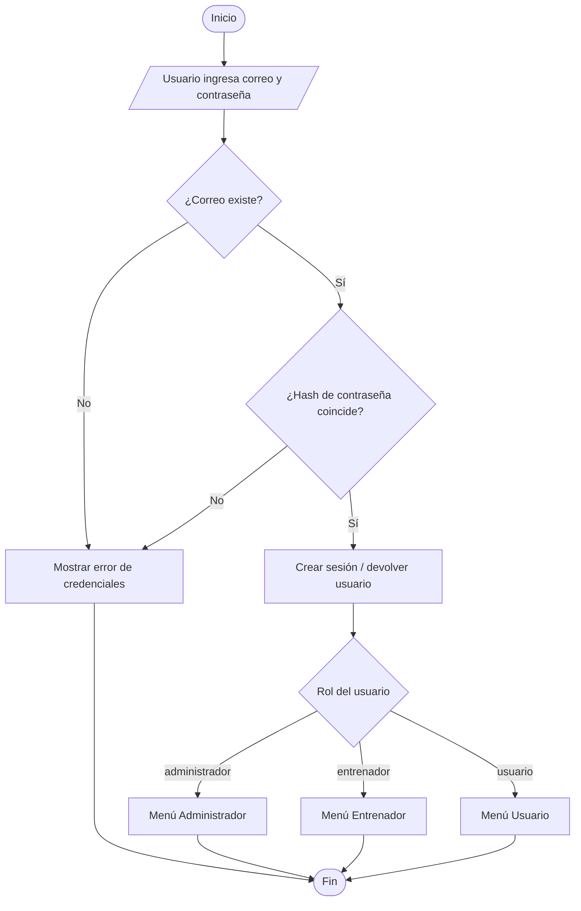
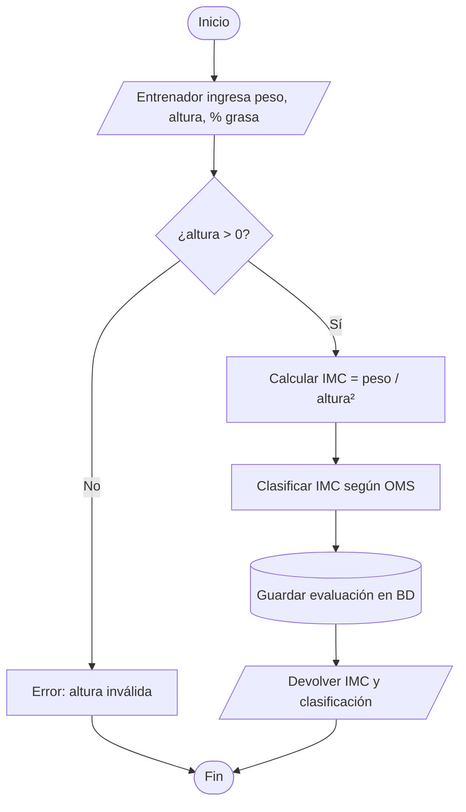
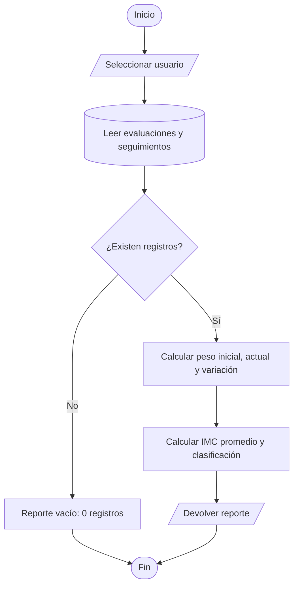
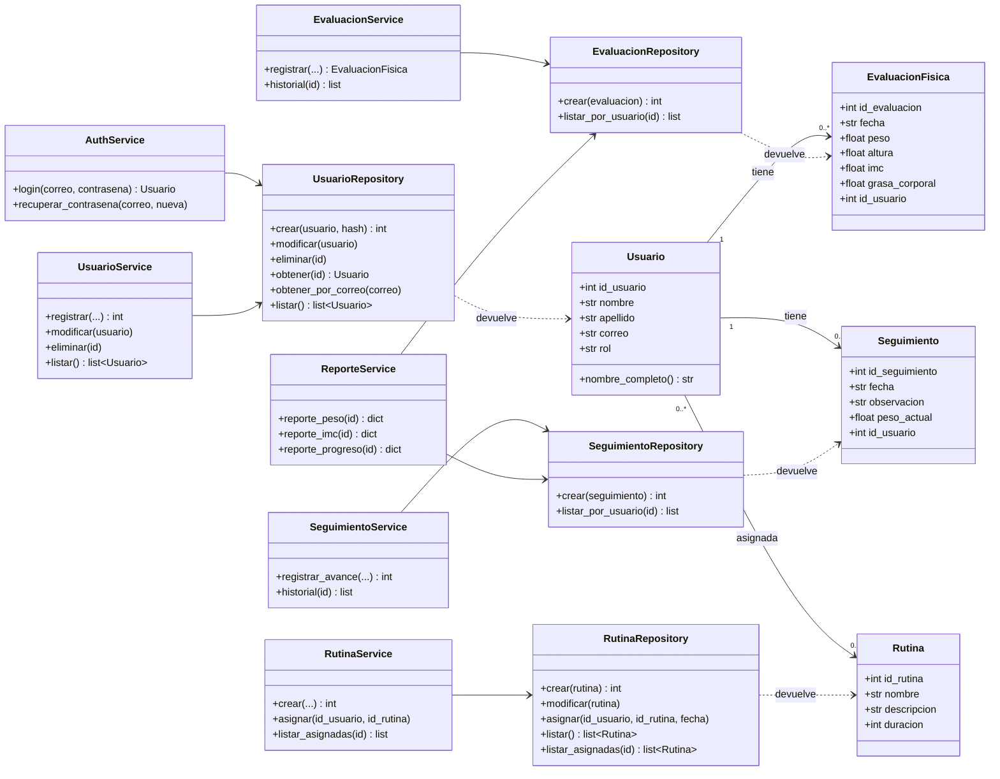
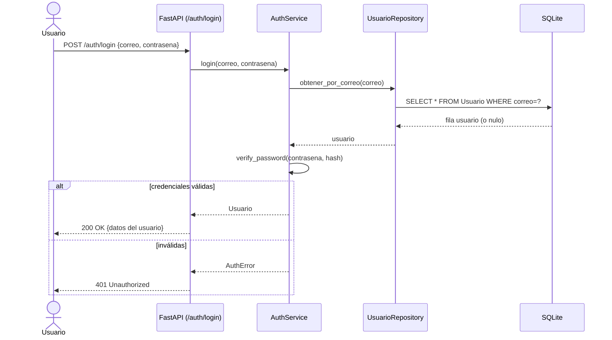
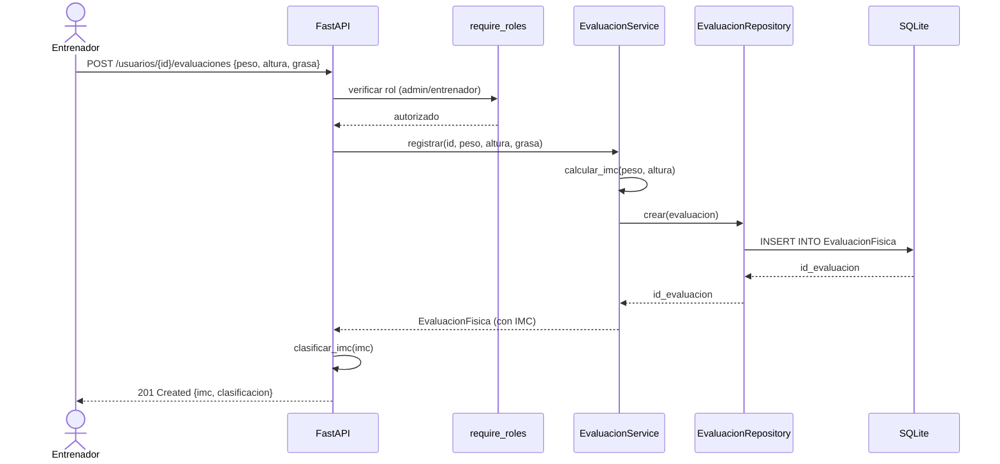
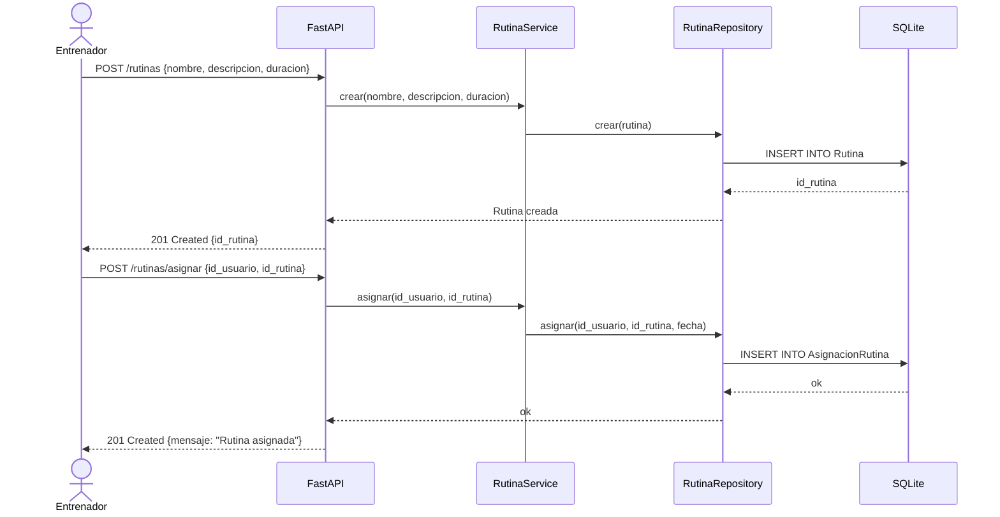
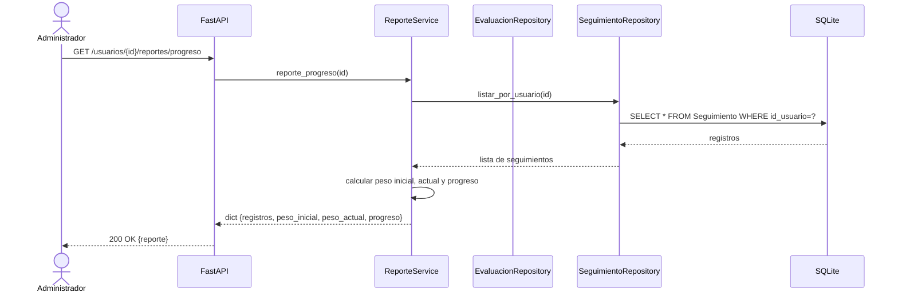

# Diagramas — Sistema de Gestión de Salud Física

Diagramas en formato **Mermaid** (se renderizan automáticamente en GitHub y en
VS Code con la extensión *Markdown Preview Mermaid*). Reflejan la implementación
real: capa de modelos, repositorios, servicios y API HTTP.

Índice:
1. [Diagrama de casos de uso](#1-diagrama-de-casos-de-uso)
2. [Diagramas de flujo](#2-diagramas-de-flujo)
3. [Diagrama de clases](#3-diagrama-de-clases)
4. [Diagramas de secuencia](#4-diagramas-de-secuencia)

---

## 1. Diagrama de casos de uso

> **Nota:** `Registrar evaluación física` siempre **incluye** `Calcular IMC`
> (el IMC se calcula automáticamente al guardar peso y altura).

---

## 2. Diagramas de flujo

### 2.1 Autenticación (login)

### 2.2 Registrar evaluación física y calcular IMC (RF02)

### 2.3 Generar reporte de progreso (RF05)

---

## 3. Diagrama de clases

---

## 4. Diagramas de secuencia

### 4.1 Inicio de sesión

### 4.2 Registrar evaluación física (cálculo de IMC)

### 4.3 Crear y asignar rutina

### 4.4 Consultar reporte de progreso

